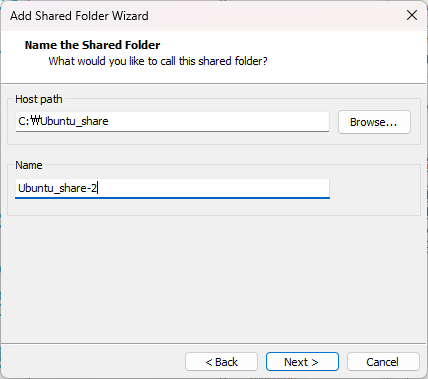
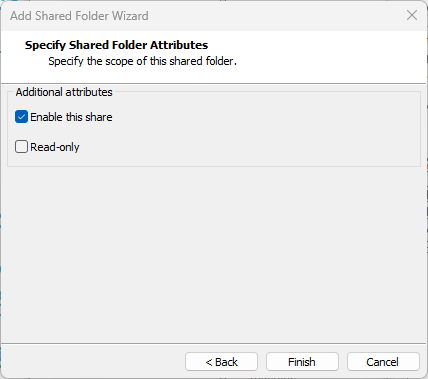
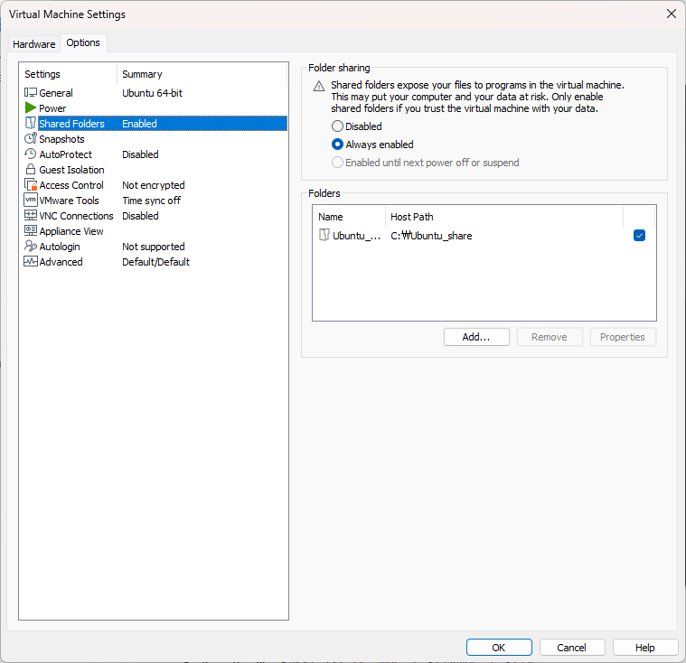
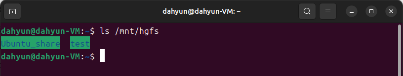
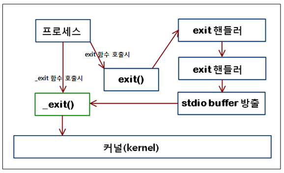

# TCP-IP-Socket-Programming
IoT 개발자 TCP/IP 소켓프로그래밍 리포지토리


## 1일차 
1. VMware 설치
    - [vmware](https://www.vmware.com/)
2. Ubuntu 설치
    - [Ubuntu 설치링크](https://ubuntu.com/download/desktop)
3. PuTTY 설치
    - [PuTTY 설치링크](https://www.putty.org/)

Ctrl + Alt + T 터미널 열기 단축키
```
sudo apt install net-tools // 네트워크 관련 도구 설치
sudo apt install openssh-server // ssh 서버(원격 접속 기능) 설치
ifconfig
> inet 102.xxx.xxx.xxx
```
```putty
> sudo apt update
> sudo apt upgrade
```

nano 편집기 설정
```
> sudo nano /etc/nanorc
set autoindent
set linenumbers
set tabsize 3
```

gcc 컴파일러 설치
```
> sudo apt install gcc
```
### 리눅스 기본 명령어 정리
- `uname- a` : 정보확인
- `cd` : 폴더 이동
- `ls` : 폴더 목록 보여줌
- `pwd` : 현재디렉토리 위치
- `cd ..` : 상위폴더로 이동
- `mkdir` : 디렉토리 생성
- `touch` : 빈 파일 생성
- `cat` : 화면 출력
- `cp` : 복사
- `clear` : 터미널 기록 삭제
- `rm -fr` : 파일/폴더 삭제
- `sudo nano /etc/nanorc` : nano 편집기 설정
- `gcc {파일명}` : 컴파일
	- -o 실행파일 이름 설정가능 
	- `gcc main.c -o {실행파일명}` (기본값 a.out)
- `./a.out` : 실행파일 실행
- `chmod` : 파일권한 변경

네트워크 프로그램은 일반적으로 클라이언트-서버 모델로 작성한다.
클라이언트-서버 : 두 프로그램이 상호작용하는 방식
- 클라이언트 : 서비스를 요청하는 쪽
- 서버 : 클라이언트가 요청한 서비스를 처리하는 쪽

### 소켓(Socket)
- 운영체제(OS) 안에서 네트워크 통신을 하기 위해 만든 **인터페이스**
- 두 컴퓨터 (또는 한 컴퓨터 안의 두 프로세스)가 데이터를 주고 받기 위해 사용하는 종단점(Endpoint)
- 내부적으로는 파일 디스크립터처럼 동작하고 `read()/write()` or `recv()/send()`로 데이터를 주고 받을 수 있음
- 물리적인 케이블, 포트 x, **가상의 통신 채널**

#### **한 줄 정리**
> **소켓(socket)은 두 컴퓨터 간 통신을 가능하게 해주는 프로그래밍 상의 "가상 통로" 또는 "연결 지점"이다.**

#### 서버 소켓 함수 호출 순서
1. socket() : 소켓 생성
2. bind() : 소켓 연결(주소 할당 - IP주소와 포트 소켓에 할당)
3. listen() : 연결 요청 대기(서버)
4. accept() : 클라 연결 허용(서버) & 새로운 소켓 반환: 반환된 소켓으로 실제 데이터 송수신에 사용
5. recv()/send() : 데이터 송/수신
6. close() : 소켓 종료

#### 클라이언트 소켓 함수 호출 순서
1. socket() : 소켓 생성
2. connect() : 서버에 연결 요청
3. send()/recv() : 데이터 송수신
4. close() : 소켓 종료

#### open()
```
int open(const char* name, int flags);
``` 

**open() 함수에서 사용하는 주요 플래그**
- #include<fcntl.h> : 헤더 추가필요
- `O_RDONLY`: 읽기 전용으로 파일 열기
- `O_WRONLY`: 쓰기 전용으로 파일 열기
- `O_RDWR`: 읽기 및 쓰기 모두 가능하게 파일 열기
- `O_CREAT`: 파일이 없으면 새로 생성 (권한 필요)
- `O_TRUNC`: 파일을 열 때 기존 내용 제거
- `O_APPEND`: 파일 끝에 데이터를 추가 (이어쓰기 모드)
**플래그는 | 연산자로 조합하여 사용함**
- 예: O_WRONLY | O_CREAT | O_TRUNC

#### read()
```
#include<unistd>

ssize_t read(int fd, void* buf, size_t count);
```
- `fd`: 읽고자 하는 파일 디스크립터 번호 (open() 또는 socket() 등을 통해 얻음)
- `buf`: 읽은 데이터를 저장할 메모리 주소 (버퍼)
- `count`: 최대 읽을 바이트 수 (버퍼 크기)
- 참고
  - ssize_t는 음수도 표현 가능한 정수형으로, 오류(-1) 처리를 위해 사용됨 (size_t : 양수만)
  - 파일 디스크립터(fd)는 리눅스에서 열린 파일을 식별하는 정수 값
#### write()
```
#include<unistd>

ssize_t write(int fd, const void* buf, size_t nbytes);
```
### 엔디안(Endian)
여러 바이트로 구성된 데이터를 메모리에 저장하거나 전송할 때, 바이트를 어떤 순서로 배열할 것인가를 결정하는 방식

#### 리틀 엔디안과 빅 엔디안
1. 빅 엔디안(Big Endian)
가장 앞 바이트에 상위 바이트를 저장

2. 리틀 엔디안(Little Endian)
가장 앞 바이트에 하위 바이트를 저장

예시) 16진수 숫자 0x12345678을 4바이트로 저장한다고 가정하면
- 빅 엔디안 : 12 34 56 78
- 리틀 엔디안 78 56 34 12
- [참고 코드](./chapter1/endian1.c)

TCP/IP 소켓 통신은 서로 다른 시스템 간의 통신이기 때문에 
A 시스템 : 리틀 엔디안, B 시스템 : 빅 엔디안 의 경우와 같이 다를 수 있다.
그러므로 통신할 때는 엔디안을 통일 시켜줘야 한다.

TCP/IP 프로토콜에서는 항상 **빅 엔디안**을 사용한다.
C/C++ 에서는 `htons`, `htonl`, `ntohs`, `ntohl` 같은 함수들을 사용해 엔디안 변환을 해준다.
- 시스템 바이트 순서 → 네트워크 바이트 순서
- 시스템 바이트 순서 → 네트워크 바이트 순서 

| 용어               | 설명                           |
| ---------------- | ---------------------------- |
| Big Endian       | 상위 바이트부터 저장 (네트워크 표준)        |
| Little Endian    | 하위 바이트부터 저장 (x86 시스템에서 일반적)  |
| htons()          | host to network short (2바이트) |
| htonl()          | host to network long (4바이트)  |
| ntohs(), ntohl() | 네트워크 → 호스트 변환                |

### Ubuntu 공유폴더 설정
vmware가  shutout 된 상태에서 VM > Settings > Optins > Shared Folders > Always enabled > Add



`Browse...` 클릭 후 공유폴더의 경로 설정, 이름 설정



- **Enable this share**
    - 이 공유 폴더를 사용할 것인지 여부
    - 체크시 VMware 가상 머신에서 해당 폴더를 인식하고 사용 가능해짐
    - 체크하지 않을 경우 폴더가 공유 목록에는 있지만 사용되지 않음
- **Read-only**
    - 읽기 전용으로 공유할지 여부
        - 체크하면 가상 머신에서는 이 폴더에 대해 **읽기만 가능**, **파일 수정, 삭제 생성 불가**
        - 체크하지 않으면 **읽기/쓰기 모두 가능**



#### VMware Tools 설치 - (`open-vm-tools` 방법)
```
sudo apt update
sudo apt install open-vm-tools open-vm-tools-desktop -y
sudo reboot
```
마운트 안 될 경우 다음 명령어를 실행해 수동 마운트 하기
```
sudo vmhgfs-fuse .host:/ /mnt/hgfs -o allow_other
```
> 참고) 마운트 명령이 없다고 뜬다면?
`sudo apt install fuse`

우분투 터미널 접속 후 다음 명령 입력 후 폴더 명이 보이면 성공
```
ls /mnt/hgfs
```

#### 자동 마운트 설정
```
sudo mkdir -p /mnt/hgfs
sudo nano /etc/fstab

다음 줄 추가 
.host:/    /mnt/hgfs    fuse.vmhgfs-fuse    allow_other    0    0
```

테스트
```
sudo mount -a
ls /mnt/hgfs
```



#### 바로가기 만들기
```
ln -s /mnt/hgfs/{공유폴더명} {~/바탕화면/공유폴더}
```

## 2일차

#### VMwere 창 캡쳐하기 
- Alt + PrtSc : 현재 창만 캡쳐
- PrtSc : 전체화면 캡쳐

#### nano 단축키
- Alt + 6 : 복사
- Ctrl + u : 붙여넣기
- Ctrl + _(언더바) : 줄 번호 이동

### sockaddr_in 구조체 정의 (IPv4 전용)
```c
struct sockaddr_in {
    sa_family_t    sin_family;  // 주소 체계: AF_INET (IPv4)
    in_port_t      sin_port;    // 포트 번호 (network byte order)
    struct in_addr sin_addr;    // IPv4 주소를 저장하기 위해 사용되는 구조체
    char           sin_zero[8]; // 구조체 크기 맞춤용 padding (사용 안함)
};
```
- `sin_family`: 주소 체계를 나타내며 보통 AF_INET으로 설정한다.
- `sin_port`: 포트 번호. htons() 함수로 호스트 바이트 순서를 네트워크 바이트 순서로 변환해서 저장해야 한다.
- `sin_addr`: 실제 IP 주소(in_addr 구조체로 감싸져 있음). inet_pton()이나 inet_addr() 등을 통해 설정한다.
- `sin_zero`: 구조체 크기를 sockaddr과 맞추기 위한 더미 배열. 실제로는 사용되지 않는다
- 참고: 원래 sockaddr_in 구조체 자체는 IPv6 주소 또한 담을 수 있다. IPv4주소만 담을 수 있는 이유는 `in_addr` 구조체 때문이다.

### in_addr 구조체 정의
```c
struct in_addr {
    in_addr_t s_addr; // IPv4 주소 (32비트 정수, network byte order)
};
```
- s_addr는 IPv4 주소를 저장하는 32비트 필드이며, `in_addr_t`는 보통 `uint32_t`
- 이 값은 네트워크 바이트 순서로 저장되어야 하므로, 보통 `inet_addr()`, `inet_pton()` 등을 사용해 IP 문자열을 변환해서 넣는다.

### in_addr_t
in_addr_t는 다음과 같이 정의된 **타입 별칭(alias)**
```
typedef uint32_t in_addr_t;
```
→ in_addr_t는 32비트 부호 없는 정수형(`uint32_t`)을 의미

→ 주로 **IPv4 주소를 표현**하는 데 사용된다.

→ `struct in_addr`처럼 구조체로 감싸진 형태와는 다른 개념.

→ `in_addr_t`는 **데이터 자체**, `in_addr는` **그걸 감싼 껍데기 구조체** 라고 볼 수 있다

#### uint32
C 표준 헤더 <stdint.h>에 정의된 고정 크기 정수형
- u = unsigned
- int = 정수
- 32 = 32비트

→ 32비트 부호 없는 정수
→ 값 범위 0 ~ 4,294,967,295 $(2^{32}-1)$


**`int`가 아닌 `uint32` 사용이유?**
int나 long 같은 기본 정수형은 플랫폼마다 크기가 달라질 수 있기 때문.
- 어떤 환경에서는 int가 32비트지만, 다른 환경에서는 16비트이거나, long이 64비트일 수도 있음
- 예시)
    - Windows에서는 long이 32비트
    - Linux 64비트에서는 long이 64비트
> 따라서 **네트워크 프로토콜, 바이너리 포맷, 파일 구조, 시스템 통신** 등
크기가 엄격히 정해져야 하는 영역에서는 `uint32_t` 같은 **고정형 타입**을 사용한다.

#### 플랫폼이란?
플랫폼 = 하드웨어(CPU 아키텍처) + 운영체제(OS) + 컴파일러

이 조합에 따라 `int`, `long` 등의 크기나 메모리 정렬 방식(endian) 등이 달라질 수 있으므로,
**크기와 바이트 순서가 중요한 네트워크/시스템 프로그래밍** 에서는 항상 **명시적 타입**을 쓰는 것이 중요합니다.

### 문자열 정보 처리 함수 정리
#### inet_addr()
```c
in_addr_t inet_addr(const char* string)
```
- IPv4 주소 문자열을 32비트 정수로 변환해주는 함수
- 성공 시 빅 엔디안으로 변환된 32비트 정수 값, 실패 시 `INADDR_NONE` 반환
- 이 함수는 deprecated(사용 권장 안 함) 상태이다.
    → 이유: `"255.255.255.256"` 같은 잘못된 주소도 그냥 처리해버릴 수 있기 때문.
- 대체로 `inet_pton(AF_INET, "192.168.0.1", &addr.sin_addr)` 사용이 권장됨.

#### inet_aton
```c
int inet_aton(const char* string, struct in_addr* addr);
```
- `inet_addr()` 과 유사하게 IPv4 문자열을 이진 형태로 바꾸는 함수
- 매개변수
    - `cp` : "192.168.0.1" 같은 IPv4 문자열
    - `inp` : 변환된 결과를 담을 struct in_addr* 포인터
- 성공시 `1`, 실패시(잘못된 IP 문자열일 경우) `0` 반환
- `inet_addr()` 보다 더 안전하고 권장되는 함수

#### inet_pton()
``` c
int inet_pton(int af, const char *src, void *dst);
```
- 위의 함수와 마찬가지로 IP 주소 문자열을 네트워크 바이트 순서로 변환해주는 함수
- IPv4 뿐만 아니라 **IPv6까지 지원**
- 문자열 IP주소 -> 정수 IP 로 바꿀 때 가장 많이 사용
- 매개변수
    - `af` : 주소 체계(`AF_INET` 또는 `AF_INET6`)
    - `src`: 변환할 IP 주소 문자열
    - `dst`: 변환될 결과를 저장할 포인터 (struct in_addr* 또는 struct in6_addr*)
- 반환값
    - `1` : 성공
    - `0`  : IP 문자열 형식이 잘못됨
    - `-1`  : `af`가 잘못되었거나 내부 오류

#### inet_addr() vs inet_aton() vs inet_pton() 
| 함수 이름     | 방향         | 지원 IP 버전    | 반환 타입       | 실패 처리 방식      | 안전성 |
| ------------- | ----------- |----------- | ----------- | ------------- | :---: |
| `inet_addr()` | 문자열 → 32비트 정수 | IPv4 only   | `in_addr_t` | `INADDR_NONE` | ❌   |
| `inet_aton()` | 문자열 → in_addr 구조체| IPv4 only   | `int`       | `0` (실패 시)    | ✅   |
| `inet_pton()` | 문자열 → 이진 주소 (IPv4/6)| IPv4 & IPv6 | `int`       | `0` 또는 `-1`   | ✅✅ |

#### inet_ntoa()
```c
char* inet_ntoa(struct in_addr in);
```
- IPv4 주소 (struct in_addr) → 문자열 변환
- 반환값: 문자열 포인터 (static 버퍼 사용)
- IPv4만 지원
- static 버퍼를 사용하므로 스레드 안전하지 않은 문제가 있다.
#### inet_ntop()
```c
const char* inet_ntop(int af, const void* src, char* dst, socklen_t size);
```
- IPv4 or IPv6 이진 주소 → 문자열 변환
- `inet_pton()`의 반대 함수
- 매개변수
    - `af`: `AF_INET` or `AF_INET6`                         
    - `src`: 이진 주소 (`in_addr*` or `in6_addr*`)               
    - `dst`: 변환된 문자열이 저장될 버퍼                                 
    - `size`: 버퍼 크기 (`INET_ADDRSTRLEN` or `INET6_ADDRSTRLEN`) 
- 반환값
    - 성공: `dst` 포인터
    - 실패: `NULL`

#### `inet_ntoa()` vs `inet_ntop()`
| 함수 이름     | 방향              | 지원 IP 버전   | 반환 타입            | 실패 처리 방식                    | 안전성          |
| ------------- | ----------------- | ----------- | ---------------- | --------------------------- | :------------: |
| `inet_ntoa()` | in_addr → 문자열 |IPv4 only   | `char*` (static) | `NULL` 반환 가능                | ❌ (스레드 비안전)  |
| `inet_ntop()` | 이진 주소 → 문자열 |IPv4 & IPv6 | `const char*`    | `NULL` 반환 (오류 시 `errno` 설정) | ✅ (스레드 안전) |
### TCP
- 응용 프로그램이 데이터를 교환할 수 있는 네트워크 대화를 설정하고 유지하는 방법을 정의하는 표준
- IP 네트워크를 통해서 통신하는 호스트에서 실행되는 애플리케이션 간에 신뢰할 수 있고, 순서가 정해져있으며, 오류를 체크하고 전송할 수 있다
- 월드 와이드 웹, 이메일, 원격 관리, 파일 전송과 같은 주요 인터넷 애플리케이션은 전송 계층의 일부인 TCP에 의존
- SSL/TLS 또한 TCP위에서 동작
- 인터넷 프로토콜(IP)과 작동하여 컴퓨터가 서로 데이터 패킷을 보내는 방법을 정의한다.
- **3-Way-HandShake** 과정을 통해 연결을 맺는다.
- **4 Way HandShake** 과정을 통해 연결을 끊는다.

#### 연결 맺는 과정 (**3-Way-HandShake**)
1. 클라이언트는 접속을 요청하는 `SYN` 패킷을 보낸다. 이때 클라이언트는 `SYN` 패킷을 보냄과 동시에 `SYN/ACK` 응답을 기다리기위해 `SYN_SENT` 상태로 변하게 된다.

2. 서버는 SYN 요청을 받고 클라이언트에게 요청을 수락하는 `ACK` 패킷과 SYN 패킷을 보내고 SYN_RCVD(SYN_RECEIVED)상태로 변하여 클라이언트가 `ACK` 패킷을 보낼 때 까지 기다리게 된다.

3. 클라이언트는 서버에 `ACK` 패킷을 보내고 이 후 `ESTABLISHED` 상태가 되어 데이터 통신이 가능하게 된다.


> - 즉, ACK 패킷의 Acknowledgement Number는 신뢰적 데이터 전송을 위해 사용되는 것이다
> - ISN( Initialized Sequence Number ): 초기 시퀀스 번호 - SYN 패킷의 Sequence Number는 운영체제의 의해서 랜덤하게 생성된다.
> - 동기화 요청에 대한 답신 - 클라이언트의 시퀀스 넘버에 +1을 해서 ack로 돌려준다.

#### 연결 끊는 과정 (**4 Way HandShake**)
1. 서버와 클라이언트가 TCP 연결이 되어있는 상태에서 클라이언트가 접속을 끊기 위해 `CLOSE()` 함수를 호출. 이후 `CLOSE()` 함수를 호출하면서 `FIN` segment를 보내게 되고 클라이언트는 `FIN_WAIT1` 상태로 변하게 된다.

2. 서버는 클라이언트가 `CLOSE()` 한다는 것을 알게되고 `CLOSE_WAIT` 상태로 바꾼 후 `ACK` segment를 전송한다. 즉, 클라이언트가 끊을 것이라는 신호를 받았다는 의미이고 `CLOSE_WAIT`를 통해 자신의 통신이 끝날때까지 기다리는 상태가 된다.

3. `ACK` segment를 받은 클라이언트는 `FIN_WAIT2`로 변환되고 이때 서버는 `CLOSE()` 함수를 호출하고 `FIN` segment를 클라이언트에게 보낸다.

4. 서버도 연결을 닫았다는 신호를 클라이언트가 수신하면 `ACK` segment를 보낸 후 `TIME_WAIT` 상태로 전환된다.

#### TCP 헤더 구조
### 서버, 클라이언트 소켓 통신 간단 구현
- [소스코드-서버](./chapter2/echo_server.c)
- [소스코드-클라이언트](./chapter2/echo_client.c)

### 서버 동작 함수
1. socket()
2. bind()
3. listen() - TCP
4. accept() - TCP
5. read/write()
6. close()

#### 1. socket()
소켓 생성 – 통신에 사용할 소켓(파일 디스크립터) 생성
```c
int socket(int domain, int type, int protocol);
```
- 매개변수
    - `domain`: 주소 체계 (AF_INET, AF_INET6, AF_UNIX)
    - `type`: 통신 방식 (SOCK_STREAM, SOCK_DGRAM)
    - `protocol`: 보통 0 (자동 선택)
- 리턴값
    - 성공: 소켓 파일 디스크립터 (0이상의 정수)
    - 실패: -1

#### 2. bind()
소켓에 IP주소 + 포트번호 할당 (주소 바인딩)
```c
int bind(int sockfd, const struct sockaddr* addr, socklen_t addrlen);
```
- 매개변수
    - `sockfd`: `socket()`에서 받은 디스크립터
    - `addr`: `sockaddr_in` 구조체 주소 (AF_INET용)
    - `addrlen`: 구조체 크기 (`sizeof(struct sockaddr_in)`)
- 리턴값
    - 성공: 0
    - 실패: -1 (포트 중복 사용, 권한 문제(1024 이하 포트))

#### 3. listen()
연결 요청 대기 상태로 전환
```c
int listen(int sockfd, int backlog);
```
- 매개변수
    - `sockfd`: bind()된 소켓 디스크립터
    - `backlog`: 연결 요청 큐의 최대 길이
- 리턴값
    - 성공: 0
    - 실패: -1

#### 4. accept()
클라이언트 연결 수락, 새 소켓 반환
```c
int accept(int sockfd, struct sockaddr* addr, socklen_t* addrlen);
```
- 매개변수
    - `sockfd`: listen() 상태의 서버 소켓
    - `addr`: 연결한 클라이언트 주소 정보 저장
    - `addrlen`: 구조체 크기(입력 + 출력)
- 리턴값
    - 성공: 새로운 소켓 디스크립터(클라이언트 전용)
    - 실패: -1

**🧠📌서버는 이때 만들어진 새로운 스크립트로 `read()/write()` 수행, 원래 `sockfd`는 계속 `accept()`에 사용**

#### 5. read() / write()
데이터 송수신 (파일/소켓 공통 함수)
```c
ssize_t read(int fd, void* buf, size_t count);
ssize_t write(int fd, const void* buf, size_t count);
```
- 매개변수
    - `fd`: accept()에서 받은 소켓 디스크립터
    - `buf`: 데이터 버퍼
    - `count`: 읽거나 쓸 최대 바이트 수
- 리턴값
    - 성공: 읽거나 쓴 바이트 수
    - 실패: -1
    - 0: 상대방이 연결 종료

#### 6. recv() / send()
`read()` / `write()`와 사용법은 유사하지만,
**소켓 통신에 특화된 확장 기능을 제공하는 함수**로, POSIX 시스템(리눅스 등)에서 사용
```c
ssize_t recv(int sockfd, void *buf, size_t len, int flags);
ssize_t send(int sockfd, const void *buf, size_t len, int flags);
```
- 매개변수 
    - `sockfd`: accept() 또는 socket()에서 반환된 소켓 디스크립터.
    데이터를 송수신할 대상 소켓을 식별하는 데 사용됨.
    - `buf`: 
        - recv()의 경우: 수신한 데이터를 저장할 버퍼
        - send()의 경우: 전송할 데이터를 담고 있는 버퍼
    - `len`: buf의 크기. 최대 송수신 바이트 수를 지정
    - `flags`: 송수신 동작을 제어하는 옵션 플래그, 일반적으로 0
        - 사용 가능한 주요 옵션:
        - MSG_PEEK: 수신 버퍼를 비우지 않고 들여다보기
        - MSG_DONTWAIT: 논블로킹 모드로 동작
        - MSG_WAITALL: 지정한 길이만큼 다 받을 때까지 대기
- 리턴값 
    - 성공: 전송된 바이트 수
    - 실패: -1
    - recv()가 0 반환 → 상대가 연결 종료

✅ read() / write()보다 소켓 전용 기능이 있어 실무에서는 recv()/send()를 더 자주 사용
#### 7. close()
열린 소켓 또는 파일 디스크립터 닫기
```c
int close(int fd);
```
- 매개변수
    - fd: socket(), accept() 등으로 생성된 디스크립터
- 리턴값
    - 성공: 0
    - 실패: -1

**🧠📌 `client_fd`, `server_fd` 모두 통신 종료 시 닫아야 리소스 해제**
  
**서버 동작 순서 요약**
```
socket()  →  bind()  →  listen()  →  accept()  →  read()/write()  →  close()
   ↑           ↑           ↑            ↑               ↑               ↑
소켓 생성   주소 할당     대기 시작    클라이언트 연결     데이터 통신       자원 해제

```

### 클라이언트 동작 함수
1. socket()
2. connect()
3. read/write()
4. close()


socket(), read/write(), close()는 함수가 같으므로 [서버 동작 함수](#서버-동작-함수) 참고

#### 2.connect()
서버에 연결 시도
```c
int connect(int sockfd, const struct sockaddr* addr, socklen_t addrlen);
```
- 매개변수
  - `sockfd`: socket()에서 얻은 소켓 디스크립터
  - `addr`: 연결할 서버의 주소 (sockaddr_in* 형 변환)
  - `addrlen`: 주소 구조체 크기
- 리턴값
  - 성공: 0
  - 실패: -1 (perror() 등으로 에러 확인)
  
**클라이언트 동작 순서 요약**
```
socket()  →  connect()  →  read()/write()  →  close()
   ↑            ↑               ↑               ↑
소켓 생성   서버에 연결 요청    데이터 통신        자원 해제

```

---
### 추가 적으로 궁금한 점 🤔
#### 파일 디스크립터(File Descriptor)
- 정수값 하나로 OS 내의 열린 리소스를 식별하는 번호
- 리눅스/유닉스 계열에 특화된 개념 
- 참고) 윈도우의 **file handle** 개념과 비슷

**🔸기본 파일 디스크립터 번호**
| 번호 | 이름       | 설명       |
|---| :------: | :-------:|
| 0  | `stdin`  | 표준 입력    |
| 1  | `stdout` | 표준 출력    |
| 2  | `stderr` | 표준 에러 출력 |

→ **모든 프로세스는 최소 0~2번까지 파일 디스크립터를 이미 열고 시작**

**🔸사용 이유**
- **모든 I/O를 추상화**해서 동일한 방식(`read()`, `write()`, `close()`)으로 다룰 수 있음
- 커널이 리소스를 효율적으로 관리할 수 있게 함

#### listen()에서 `backlog`의 의미는?
`listen(fd, backlog)`에서 backlog는 동시 접속 요청을 처리하는 개수❌,
**아직 accept()로 처리되지 않은 연결 요청을 몇 개까지 대기시킬 수 있는가⭕** 를 의미한다.
예시: `backlog = 5` 일 때
- A ~ F 가 동시에 접속 요청을 보냈을 경우
    - A ~ E는 대기 큐에 들어감
    - F는 연결실패

#### 클라이언트가 대기 큐에 못 들어갔을 때 발생하는 일
TCP 통신은 **3-way handshake** 과정을 거친다:
- 클라이언트 connect() 호출 (`SYN` 패킷 보냄)
- 서버가 받아서 `SYN-ACK`를 보냄
- 클라이언트가 다시 `ACK`를 보냄
- 서버와 클라이언트 연결 완료

backlog가 가득 찼다면, 서버는 다음 중 하나를 수행한다:
- `SYN-ACK`을 보내지 않음 (즉시 무시)
- `SYN-ACK`을 보냈더라도 이후 연결을 끊음 (RST)


클라이언트에서는
- `connect()` 지연: TCP는 재전송 시도
- `connect()` 실패: 최종적으로 응답이 없으면 `ECONNREFUSED` 또는 `ETIMEDOUT` 오류 발생
- 일시적 성공 후 끊김: handshake는 성공했지만 `accept()`되지 않아 바로 `RST` 로 인해 연결 종료

이러한 경우 
- 클라이언트가 잠깐 멈췄다가 재시도 
- 로드밸런서나 큐 시스템 사용
- 서버 측에서 `accept()`를 빨리 처리하거나, backlog 값을 늘려서 대응할 수 있다.

#### 개발자가 대응할 수 있는 방법
대기 큐가 가득 찬 이후의 동작은 운영체제가 정한다 → **개발자가 직접 제어는 불가**
개발자가 할 수 있는 것은 큐가 가득 차기 전에 **대응**하는 것!
- backlog 값 늘리기: `listen(fd, SOMAXCONN)` + 커널 제한 확인 `(/proc/sys/net/core/somaxconn)`
- accept 최적화: 블로킹 처리 개선, 멀티스레딩, 논블로킹 IO 사용
- epoll, select 활용: 효율적인 다중 클라이언트 처리
- 리버스 프록시 도입: Nginx, HAProxy 등으로 요청 분산
- 클라이언트 재시도 로직 구현: 실패 시 exponential backoff 방식 재시도 등

각 방식에 대해서는 추후에 공부 후 추가

## 3일차
### UDP 소켓 전용 입출력 함수
UDP는 연결less 방식이며, 신뢰성 없는 비연결형 전송을 제공된다. 일대일의 연결관계가 아니기 때문에 listen()과 accept()가 필요 없다. 
클라이언트의 주소 할당은 sendto 함수 호출 시 자동으로 할당된다.
단, 일대일 연결이 지속될 경우는 connect 함수를 사용하여 주소 정보를 저장시키고 sendto, recvfrom 함수 대신 write, read 함수로 데이터를 주고 받으면 된다. 

#### sendto()
`send()`와 달리 보낼 주소 정보를 명시해야 함
```c
sendto(sockfd, buffer, strlen(buffer), 0,
       (struct sockaddr*)&client_addr, sizeof(client_addr));
```
- 매개변수
    - `sockfd`: 전송할 소켓의 파일 디스크립터                                  
    - `buf`:  보낼 데이터가 담긴 버퍼의 포인터                               
    - `len`: 보낼 데이터의 바이트 수                                     
    - `flags`: 일반적으로 0 사용. (비트 플래그)                              
    - `dest_addr`:  데이터를 보낼 대상의 주소 (IP + 포트)                          
    - `addrlen`:  `dest_addr` 구조체 크기 (`sizeof(struct sockaddr_in)`) 
- 리턴값
    - 성공: 전송한 바이트 수
    - 실패: -1 반환
### recvfrom()
데이터를 수신하고 보낸 사람 주소 정보도 받음
```c
socklen_t addrlen = sizeof(client_addr);
recvfrom(sockfd, buffer, sizeof(buffer), 0,
         (struct sockaddr*)&client_addr, &addrlen);
```
- 매개변수
    - `sockfd`: 수신할 소켓의 파일 디스크립터                                  
    - `buf`:  수신된 데이터가 담긴 버퍼의 포인터                               
    - `len`: 최대 수신 바이트 수 (버퍼크기)                                     
    - `flags`: 일반적으로 0 사용.                              
    - `dest_addr`:  보낸 쪽 주소가 저장될 구조체 포인터                         
    - `addrlen`:  `src_addr`의 크기를 담은 변수의 주소 (입출력용)
- 리턴값
    - 성공: 수신한 바이트 수
    - 실패: -1 반환
### TCP 소켓 연결 제어 함수 - `shutdown()`
#### shutdown()
양방향 TCP 연결 중 한 방향(송신 또는 수신)만 선택적으로 끊고 싶을 때 사용하는 함수. (양방향 끊기도 가능함)
```C
int shutdown(int sockfd, int how);
```
- 매개변수
    - sockfd: 종료할 소켓의 파일 디스크립터
    - how: 종료 방식 선택(`SHUT_RD`, `SHUT_WR`, `SHUT_RDWR`)
        - `SHUT_RD`: 수신 종료
        - `SHUT_WR`: 송신 종료
        - `SHUT_RDWR`: 송수신 모두 종료
- 반환값
    - 성공: 0
    - 실패: -1

**사용 예시**
- HTTP/1.0 통신 (클라이언트 입장)
    - 서버가 `read()`로 요청을 읽을 때, 클라이언트가 `shutdown(SHUT_WR)`을 안 하면 계속 기다림
    - `shutdown()`으로 송신 종료를 명시함으로써 서버가 정상적으로 요청을 처리하게 유도함
- 파일 전송 후 결과 기다리는 클라이언트
    - 파일을 전송한 후 서버가 "성공" 메시지를 보내줄 때까지 기다림
- SMTP (메일 프로토콜) 클라이언트
    - 메일 데이터를 다 보낸 후 DATA 명령 종료를 알리기 위해 `.`전송 + 송신 종료

**🧠📌 `shutdown()`은 소켓의 송/수신 기능만 비활성화 할 뿐, 소켓 리소스 자체를 해제하거나 커널에서 FD를 반납하지 않기 때문에 colse()를 사용해 리소스를 해제해주어야 한다.**

**❓shutdown(SHUT_WR) 이후에 다시 송신가능?**
>-> shutdown()을 한 후 기존 소켓으로 송/수신을 다시 할 수 없다. 
- 이유:
    - TCP는 연결지향 프로토콜
    - shutdown(SHUT_WR)은 TCP 레벨에서 `FIN` 패킷을 전송하는 동작
    - FIN은 "내 쪽 송/수신 스트림은 이제 끝났어"라는 약속이므로, 이 후에는 `send()` 불가능
    - 이는 **TCP 프로토콜 표준에 따른 동작**이며, 시스템이 강제로 막음
- 만약 `SHUT_WR` 후 `send()`를 호출하면?
    - send()가 실패하고 -1 반환
    - errno == `EPIPE` (Broken pipe)
    - 리눅스에서는 `SIGPIPE` 시그널로 프로세스가 종료될 수도 있음
        - 방지하려면: `signal(SIGPIPE, SIG_IGN);` 또는 `MSG_NOSIGNAL` 플래그 사용 (send())
- 다시 송/수신 하고 싶은 경우 
    - 기존소켓 close()
    - `socket()` → `connect()` 또는 `accept()`로 **새 소켓**을 생성해야 한다. 


#### gethostbyname()
도메인 이름 → IP 주소 변환 함수:
```c
struct hostent *gethostbyname(const char *name);
```
#### gethostbyaddr()
IP 주소 → 도메인 이름 변환 함수
```c
struct hostent *gethostbyaddr(const void *addr, socklen_t len, int type);
```
### struct hostent 구조체
```c
struct hostent {
    char  *h_name;       // 공식 호스트 이름
    char **h_aliases;    // 별칭 목록 (NULL로 끝남)
    int    h_addrtype;   // 주소 체계 (보통 AF_INET)
    int    h_length;     // 주소 길이 (IPv4는 4)
    char **h_addr_list;  // IP 주소 목록 (char*의 배열)
};
```

### 멀티프로세스
단순한 TCP 서버의 경우 `accept()` 이후로 해당 클라이언트와 통신이 끝날 때까지 **다음 클라이언트를 받을 수 없다.**

멀티 클라이언트를 처리하려면 **멀티 프로세스** or **멀티 스레드 구조**로 서버를 구현해야 한다.


멀티 클라이언트를 처리하는 4가지 방법
1. `fork()` 사용 (멀티 프로세스)
   - 클라이언트가 연결되면 자식 프로세슬르 만들어 처리
   - 부모는 다시 `accept()`를 호출해 새로운 연결 수락 가능
2. `pthread` 등으로 멀티스레딩
   - 스레드를 생성해서 클라이언트가 담당
   - 메모리 공유가 가능해서 프로세스보다 가볍고 유연
3. `select()`/`poll()`/`epoll()`
   - 하나의 스레드로 여러 클라이언트의 이벤트를 감시
   - 논블로킹 I/O와 이벤트 기반 처리
4. 비동기 I/O (예: `libuv`, `boost::asio`)
   - 현대적인 방식으로, 많은 연결을 효율적으로 처리

#### 프로세스
실행 중인 프로그램 인스턴스를 의미한다.

프로세스를 생성하기 위해서 부모 프로세스는 `fork()` 함수를 호출하여 자식 프로세스를 생성한다.
- **부모 프로세스**
  - `fork()`를 호출한 **원래의 프로세스**
  - 자식 프로세스를 생성하는 주체
  - **자식의 PID**를 `fork()` 함수의 리턴값으로 받음

- **자식 프로세스**
  - `fork()` 호출로 **새로 복제된 프로세스**
  - 부모와 거의 동일한 메모리 상태로 시작
  - fork 함수의 반환 값으로 **0**을 받음

#### 프로세스와 프로세서의 차이
**프로세서(Processor)**
- 컴퓨터의 중앙 처리 장치(CPU)
- 모든 연산과 제어의 중심 역할을 함
- 생성된 여러 프로세스를 번갈아 실행시키는 역할을 함(스케줄링)
**프로세스(Process)**
- 실행중인 프로그램을 의미
- 운영체제(OS)가 관리 
#### fork()
- 리눅스/유닉스 시스템 프로그래밍에서 새로운 프로세스를 생성할 때 사용하는 시스템 호출
- 현재 실행 중인 프로세스를 복제하여 **자식 프로세스(child process)** 를 생성
- 자식 프로세스는 부모의 메모리 상태를 복사한 뒤, `fork()` 호출 **시점부터 독립적으로 실행된다.**
- 변수 값, 파일 디스크립터 등의 상태를 **그대로 이어받지만**, 실행 흐름은 독립적이다.
- fork() 호출 이후, 부모와 자식 프로세스는 동시에 실행됨.

반환값
| 프로세스    | 반환값          | 의미                    |
| ------- | ------------ | --------------------- |
| 부모 프로세스 | > 0 (자식 PID) | 자식 프로세스 생성에 성공함       |
| 자식 프로세스 | 0            | 자신이 자식 프로세스라는 의미      |
| 실패 (부모) | -1           | 프로세스 생성 실패 (리소스 부족 등) |

**🧠📌 fork()는 성공하면 부모/자식 프로세스가 각각 독립적으로 실행되며, 어떤 쪽이 먼저 실행될지는 OS 스케줄러에 따라 달라진다.**

#### 좀비 프로세스 (Zombie Process)
자식 프로세스가 종료되었지만, 부모 프로세스가 그 종료 상태를 수거하지 않아 아직 시스템에 **"죽은 흔적"**으로 남아 있는 프로세스
> 실제로는 이미 종료 but 운영체제 입장에서는 아직 완전히 처리되지 않은 상태

- 좀비 상태가 생기는 이유?
  - 자식 프로세스가 `exit()`로 종료
  - 부모 프로세스가 `wait()` 또는 `waitpid()`로 종료 상태 수거하지 않음
  - 이 때 자식 프로세스는 **좀비 상태**가 됨
- 좀비 프로세스 확인 방법
  - 자식 프로세스 생성 후 `sleep()` 걸어두기
  - `ps aux | grep Z` 입력
- 문제점
  - PID 낭비
  - 커널 리소스를 쓸데없이 차지해서 시스템에 악영향을 끼침
- 해결 방법
    - 부모가 살아있고 `wait()` 안 했을 경우 -> 부모에게 `wait()` 넣어주기
    - 부모 이미 죽었을 경우 -> os가 자동으로 정리(init 프로세스가 수거)
    - 부모가 고의로 방치 -> `SIGCHLD` 시그널 핸들링 추가 

#### wait()
부모 프로세스가 자식 프로세스가 종료될 때까지 기다리게 하는 함수
자식 프로세스가 종료되면 종료상태를 부모가 받아 운영체제가 정상적으로 처리할  수 있게 도와준다(좀비 프로세스 방지)
```c
#include <sys/types.h>
#include <sys/wait.h>

pid_t wait(int *status);
```
리턴 값
- 자식이 정상 됐을 경우: 자식의 PID
- 자식 없음 OR 이미 처리: -1(실패)
- 오류 발생: -1
#### waitpid()
특정 자식만 기다리거나 비동기 처리가 필요할 경우 사용
options를 통해 **논블로킹**도 가능
```C
#include <sys/types.h>
#include <sys/wait.h>

pid_t waitpid(pid_t pid, int *status, int options);
```
- 매개변수 
    - pid: 어떤 자식을 기다릴지 지정
        - `> 0`: 특정 자식 PID
        - `= 0`: 같은 그룹의 자식 중 하나
        - `= -1`: 모든 자식 (기본값, wait()과 동일)
        - `< -1`: 특정 프로세스 그룹의 자식
    - status: 자식 종료 상태를 저장할 변수의 포인터
    - options: 대기 방식 지정. 보통 `0`, `WNOHANG`, `WUNTRACED` 를 사용 
- 리턴 값
    - 자식 PID: 정상 종료
    - `0`: WNOHANG 옵션 사용 시, 아직 종료되지 않음
    - `-1`: 에러 발생
#### waitid()
wait 보다 자세한 정보가 필요하거나 POSIX 호환이 필요한 경우
siginfo_t 구조체를 통해 보다 풍부한 정보를 얻을 수 있음
```C
#include <sys/types.h>
#include <sys/wait.h>

int waitid(idtype_t idtype, id_t id, siginfo_t *infop, int options);
```
- 매개변수
    - idtype: 	어떤 종류의 ID를 기다릴지 (P_PID, P_PGID, P_ALL)
    - id: 실제 PID 또는 PGID 또는 0
    - infop: 자식의 종료 정보를 담을 siginfo_t*
    - options: `WEXITED`, `WNOHANG`, `WSTOPPED`, `WNOWAIT` 등
- 리턴 값
    - 성공: 0
    - 실패: -1
#### status 값 확인 방법
- WIFEXITED(status) - 정상 종료 여부
- WEXITSTATUS() - exit()에서 반환한 종료 코드 
- WIFSIGNALED(status) - 시그널로 종료되었는지 여부
- WTERMSIG() - 종료시 사용된 시그널 번호
#### 종료함수
```c
void _exit(int status);
void exit(int status);
int atexit(void (*function)(void)); // 나중에 추가 할 것
```
- `_exit()`
  - 호출 프로세스 **즉시** 종료
  - 프로세스에 속한 열린 fd 모두 닫힘
  - 프로세스의 자식들은 프로세스의 1번인 init프로세스에게 승계
  - 부모에게는 `SIGCHLD` 시그널이 보냄
  - 값 `status`를 부모 프로세스에게 프로세스의 종료 상태로 반환
- `exit()`
  - 표준 입출력 라이브러리들에서 사용한 버퍼를 모두 방출(flush)
  - `atexit()`에서 등록시킨 exit 핸들러들을 모두 실행
  - `_exit()` 호출
  - 참고) `main()` 함수안에서 `return()`은 `exit()`와 동일



## 4일차
### 시그널 함수
- `#include <signal.h>` 헤더파일 필요
- 특정 시그널이 발생했을 때 어떤 동작을 할지 설정하는 함수
#### signal()
```c
#include <signal.h>

void (*signal(int signum, void (*handler)(int)))(int);
```
- 매개변수
    - `signum`: 설정할 시그널 번호
    - `handler`: 해당 시그널이 발생했을 때 실행할 함수(핸들러)
        - 함수포인터: 사용자 지정 함수
        - `SIG_DFL`: Default 동작 수행
        - `SIG_IGN`: 시그널 무시

#### sigaction()
`signal()` 함수보다 더 정교하고 안전하게 시그널을 다룰 수 있어서 시그널 처리의 표준 함수로 권장되는 함수
```c
int sigaction(int signum, const struct sigaction *act, struct sigaction *oldact);
```
- 매개변수
    - `signum`: 처리할 시그널 번호
    - `act`: 새로 설정할 시그널 처리 동작에 대한 정보 (`struct sigaction*`)
    - `oldact`: 이전 시그널 처리기를 저장할 곳 (`NULL`이면 무시)
- 반환값
    - 성공: 0
    - 실패: -1
```c
struct sigaction {
    void (*sa_handler)(int);   // 시그널 핸들러 함수 포인터
    sigset_t sa_mask;          // 시그널 핸들러 실행 중 블록할 시그널 집합
    int sa_flags;              // 동작 제어 플래그 (예: SA_RESTART, SA_SIGINFO)
};
```

#### 자주 사용되는 시그널 정리 

| 시그널 이름    | 번호 | 의미                    |
| --------- | -- | --------------------- |
| `SIGINT`  | 2  | 인터럽트 신호 (Ctrl + C)    |
| `SIGTERM` | 15 | 종료 요청 (일반적인 종료 요청)    |
| `SIGKILL` | 9  | 강제 종료 (무조건 종료, 무시 불가) |
| `SIGSTOP` | 19 | 일시 정지 (무시 불가)         |
| `SIGCONT` | 18 | 정지 → 재개               |
| `SIGCHLD` | 17 | 자식 종료 알림              |
| `SIGALRM` | 14 | 알람 시그널 (시간 초과)        |

// 엣지 트리거 // 레벨트리거 방식

### 프로세스간 통신